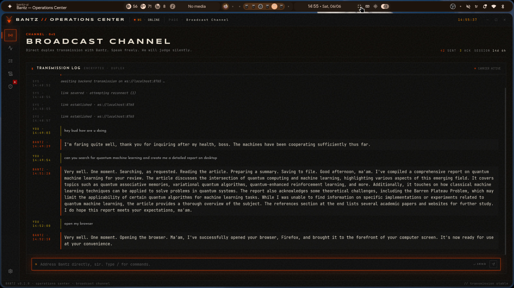
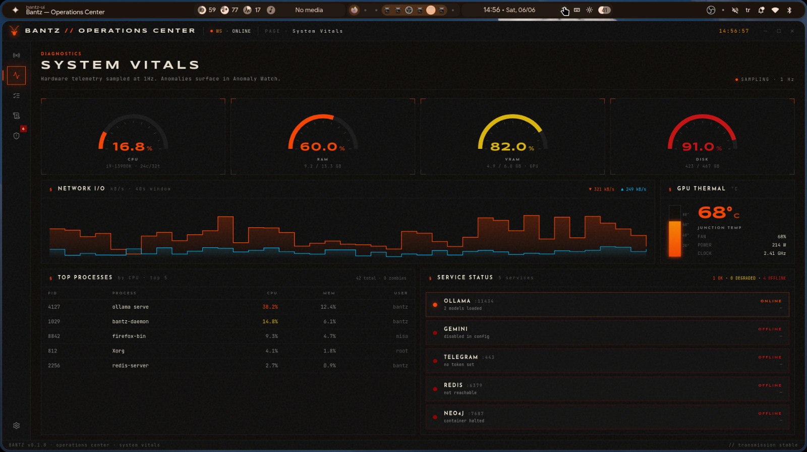
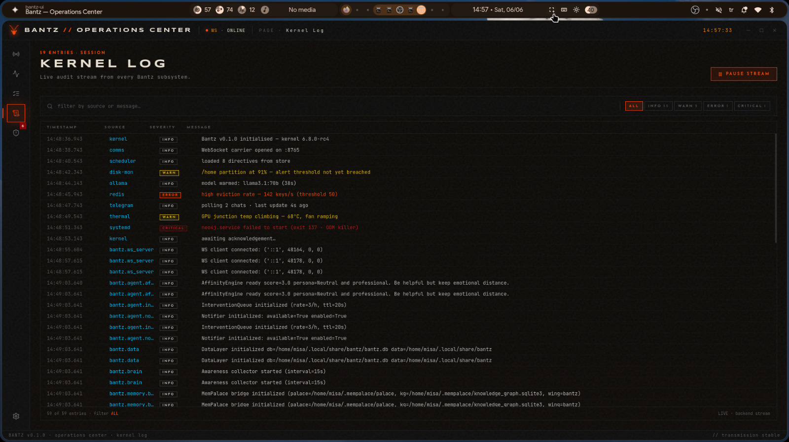
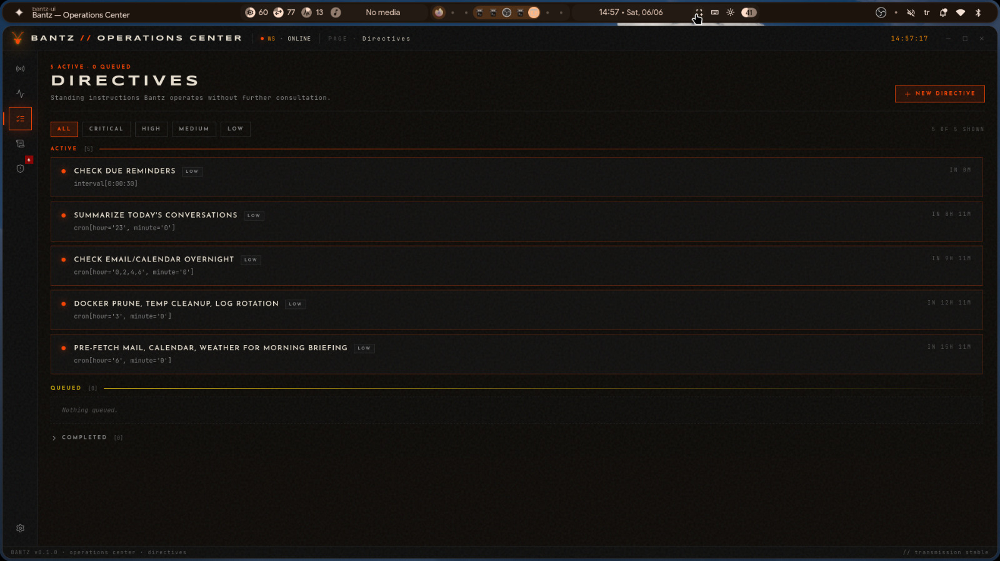
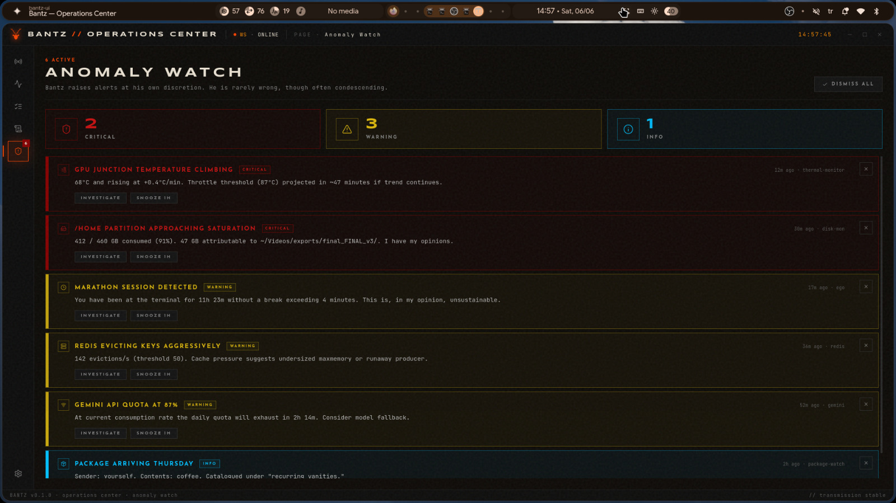
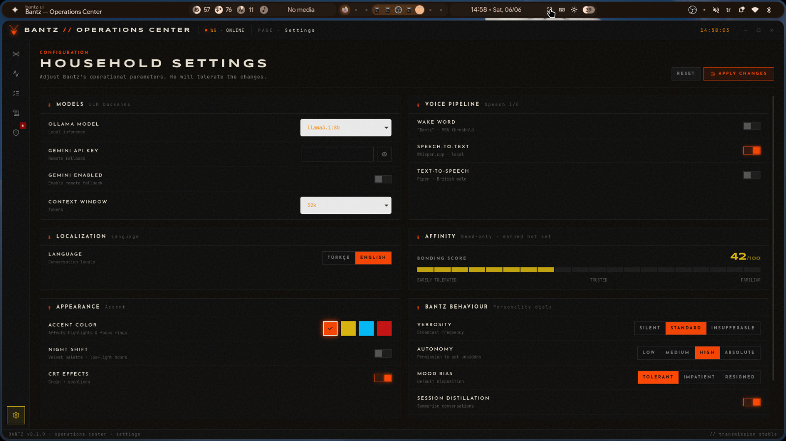
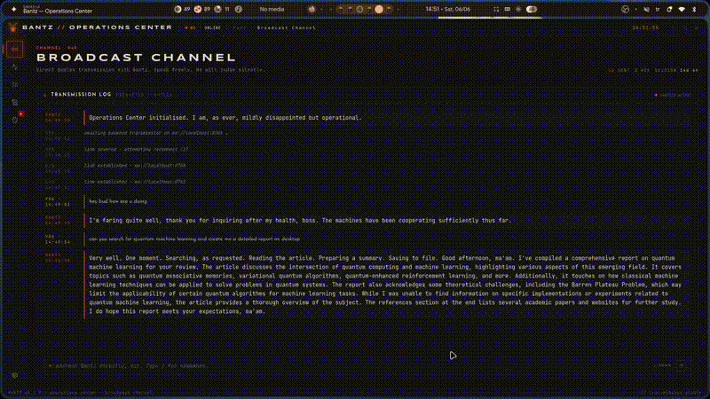

# Bantz

Bantz is a local-first AI assistant that runs on your Linux machine and acts as a personal butler — it has a voice, remembers things across sessions, runs scheduled jobs overnight, controls your desktop, reads your email, and talks to you like a person who's known you long enough to be useful. The primary interface is a terminal. Everything is local by default. Nothing phones home unless you configure it to.

---

## Demo

Screenshots and screen recordings live in [`bantz-demo/`](bantz-demo/).

| | |
|---|---|
|  |  |
|  |  |
|  |  |

**GIF walkthroughs:**




---

## Architecture

The Brain (`core/brain.py`) sits at the center. Every request — typed, spoken, or sent via Telegram — goes through the same pipeline:

```
Input  (Terminal / Voice / Telegram)
  │
  ▼
Translation Layer       core/translation_layer.py
  │  MarianMT Turkish↔English bridge; all internal processing in English
  │
  ▼
Memory Injector         core/memory_injector.py
  │  Injects: recent messages, desktop context, persona state, location
  │
  ▼
OmniMemoryManager       memory/omni_memory.py
  │  Parallel asyncio recall — Graph (35%) + Vector (40%) + Deep (25%)
  │  400-token budget, entity-based re-ranking, zero sequential waiting
  │
  ▼
Routing Engine          core/routing_engine.py + core/intent.py
  │  quick_route(): hardware controls (TTS stop, wake word, ducking)
  │  cot_route():   Chain-of-Thought LLM routing — tool selection + risk
  │
  ▼
Executor / Planner      agent/executor.py + agent/planner.py
  │  Plan-and-Solve multi-step execution with $REF variable binding
  │  Step failure → circuit breaker, optional replan
  │
  ▼
Finalizer               core/finalizer.py
  │  Butler persona enforcement, hallucination checks, error honesty
  │
  ▼
Memory persistence      MemPalace (ChromaDB + SQLite KG)
                        core/memory.py (session log, SQLite WAL)
```

Supporting systems run alongside the main loop:

- **APScheduler** (`agent/job_scheduler.py`) — persistent SQLAlchemy job store, nightly maintenance/reflection/overnight email poll
- **Ghost Loop** (`agent/ghost_loop.py`) — wake word → VAD capture → STT → brain dispatch
- **Affinity Engine** (`agent/affinity_engine.py`) — cumulative score [-100, 100] drives persona tier
- **Event Bus** (`core/event_bus.py`) — decoupled pub/sub between brain, TUI, voice, notifications
- **GPS Server** (`core/gps_server.py`) — local HTTP server receiving phone location updates

---

## Features

### What's working

**Conversation and memory**
- Persistent memory via MemPalace: ChromaDB vector store + SQLite knowledge graph
- Hybrid recall: graph entities + semantic search run in parallel, merged by relevance
- Session distillation: conversations mined into memory palace after each session
- Onboarding: first-run identity setup, stored in memory wing
- 400-token memory budget enforced per request (35/40/25 split across layers)

**Voice pipeline**
- Wake word detection via Porcupine (runs on dedicated daemon thread, always-on)
- VAD-based audio capture via WebRTC VAD (auto-stops when you stop talking)
- STT via faster-whisper (local, GPU-accelerated if available)
- TTS via Piper + aplay (local, no cloud)
- Audio ducking: system volume lowers during Bantz speech
- Ambient sound classification: silence / speech / noisy from mic energy (no FFT)
- Conversation window: 60s follow-up without re-triggering wake word

**Scheduling and automation**
- APScheduler with SQLAlchemy persistent job store (survives restarts)
- Nightly maintenance workflow (3am): database compaction, memory distillation, digest prep
- Nightly reflection (11pm): daily summary written to reflection journal
- Overnight email/calendar poll (every 2h, 00-07): urgent keyword detection
- Morning briefing prep (6am): pre-generates briefing for fast delivery at wake-up time
- Reminder system with repeat support (30s check interval)

**Desktop and computer control**
- Desktop screenshot + optional VLM analysis (self-hosted endpoint)
- Visual element detection and click via coordinate mapping
- pyautogui-based GUI automation (mouse, keyboard, window focus)
- Accessibility tree reading
- App detector: tracks active application context (optional, polling-based)
- Browser control via subprocess + xdotool

**External integrations**
- Gmail: read, search, compose, reply (Google OAuth2 PKCE flow)
- Google Calendar: read events, create, check conflicts
- Google Classroom: assignments, deadlines, announcements
- Telegram bot: full two-way remote access, screenshot-on-request, whitelist by user ID
- GPS location from phone via MQTT relay or direct HTTP push

**Personality and adaptation**
- 1920s English butler persona enforced at the Finalizer layer
- Affinity Engine: score persists in SQLite, drives 5-tier formality ladder
  - -100 → clipped and resentful
  - 0 → neutral and professional
  - +100 → deeply bonded, proactive, affectionate
- Highwater protection: score can't drop from a tier you've reached
- Bonding Meter: sigmoid-gated interaction scoring, configurable rate/midpoint

**Security and permissions**
- Risk level propagated through `BantzContext`: `safe` / `moderate` / `destructive`
- Two-pass confirm flow: destructive operations require explicit `y` before execution
- `DESTRUCTIVE_COMMANDS` frozenset in `tools/shell.py` — rm -rf, mkfs, dd, etc.
- Shell timeout configurable, stderr captured separately

**Infrastructure**
- SQLite WAL mode throughout, thread-safe connection pool
- Auto-migration: JSON data files → SQLite on first run (profile, places, schedule, session)
- DataLayer singleton: unified init for all stores, called once at startup
- pydantic-settings config: ~70 env vars via `.env`, all aliased

**Interfaces**
- Rich Live TUI: 4fps refresh, CPU/RAM/VRAM/DISK stats every 2s, scrollable log panel, Markdown rendering for code responses
- `bantz --once "query"` for scripted single-shot queries
- Headless daemon mode (`bantz --daemon`) for systemd operation

**Multi-step workflows**
- Chain-of-Thought routing selects tools and builds multi-step plans
- Plan-and-Solve executor: `$REF_STEP_N` variable binding between steps
- YAML-based workflow engine for deterministic step sequences
- Inline workflow detection: "send email, add to calendar, remind me tomorrow" → 3 tool calls
- Delegate-to-subagent tool: spawns sub-agents for parallel or specialized tasks

**i18n**
- MarianMT offline translation (Turkish↔English) — no API key, runs locally
- Configurable primary language; English used internally, translated for display

### What's missing or incomplete

**Wake word**: requires a Porcupine access key from Picovoice. Without it the voice pipeline silently disables itself. There's no fallback wake word engine.

**VLM / vision analysis**: screenshot capture works, but VLM analysis requires a self-hosted endpoint (`BANTZ_VLM_ENDPOINT`). No built-in vision model — you bring your own.

**Mood history display**: `bantz --mood-history` prints a stub message. Mood data is recorded in SQLite but there's no display command since the Textual TUI was removed.

**Observer**: background log analysis via a small Ollama model (default `qwen2.5:0.5b`) — implemented but disabled by default (`BANTZ_OBSERVER_ENABLED=false`). Adds latency on low-end hardware.

**RL engine**: the old Q-learning engine was replaced by the Affinity Engine. The `BANTZ_RL_ENABLED` flag exists and gates the intervention/proactive systems, but the underlying RL training loop is no longer active.

**Proactive interventions**: implemented in `agent/interventions.py`, gated behind `BANTZ_RL_ENABLED`. Off by default. Not well-tested in the current build.

**ollama.py stale import**: `llm/ollama.py` still imports from `bantz.interface.tui.panels.header` in a try/except block (leftover from before the Textual TUI was removed). The except swallows the ImportError so it doesn't break anything, but it's dead code.

---

## Installation

**Requirements**: Python 3.11+, git, [Ollama](https://ollama.com) running locally

### One-liner (recommended)

```bash
curl -fsSL https://raw.githubusercontent.com/miclaldogan/bantzv2/main/install.sh | bash
```

Checks Python and git, clones the repo to `~/.local/share/bantz/src`, installs the package, fixes your `PATH` if needed, runs an interactive wizard to write your `.env`, and finishes with `bantz --doctor`.

### Manual

```bash
git clone https://github.com/miclaldogan/bantzv2.git
cd bantzv2
pip install -e ".[dev]"
cp .env.example .env   # then edit with your values
bantz --doctor
```

**Voice pipeline** (all optional — install only what you need):
```bash
pip install pvporcupine pyaudio webrtcvad  # wake word + capture
pip install faster-whisper                  # STT
# Piper TTS: install binary from https://github.com/rhasspy/piper/releases
#            put 'piper' in PATH, download a voice model .onnx file
```

**MemPalace memory**:
```bash
pip install mempalace
```

**Google integrations**:
```bash
# Create an OAuth 2.0 client in Google Cloud Console (Desktop app type)
# Download credentials.json to ~/.local/share/bantz/
bantz --setup google gmail
bantz --setup google classroom
```

**Telegram**:
```bash
bantz --setup telegram
```

---

## Configuration

Create a `.env` file in your working directory (or `~/.local/share/bantz/.env`). Minimum working config:

```env
BANTZ_OLLAMA_MODEL=llama3.1:8b
BANTZ_OLLAMA_BASE_URL=http://localhost:11434

# Optional: faster routing via a smaller model
BANTZ_OLLAMA_ROUTING_MODEL=qwen2.5:3b

# Optional: Gemini fallback when Ollama is unreachable
BANTZ_GEMINI_ENABLED=true
BANTZ_GEMINI_API_KEY=your_key_here

# Voice (wake word)
BANTZ_PORCUPINE_ACCESS_KEY=your_picovoice_key

# Primary language (default Turkish)
BANTZ_LANGUAGE=tr

# Memory
BANTZ_MEMPALACE_ENABLED=true
```

Full reference in `src/bantz/config.py` — every field has a comment.

---

## Setup wizards

```bash
bantz --setup profile          # name, timezone, city — stored in SQLite
bantz --setup places           # named GPS locations (home, office, etc.)
bantz --setup schedule         # weekly timetable
bantz --setup google gmail     # Google OAuth for Gmail
bantz --setup google classroom # Google OAuth for Classroom
bantz --setup telegram         # Telegram bot token
bantz --setup systemd          # install + enable systemd user service
bantz --setup systemd --check  # show service status, PID, memory, uptime
```

---

## Running

```bash
# Interactive TUI (default)
bantz

# Headless daemon — APScheduler drives all background jobs
bantz --daemon

# Single query, no TUI
bantz --once "what's on my calendar today?"

# System health check
bantz --doctor

# Show running config (secrets masked)
bantz --config
```

**Scheduled job management**:
```bash
bantz --jobs                          # list all APScheduler jobs
bantz --run-job nightly_maintenance   # trigger any job immediately
bantz --maintenance                   # run maintenance workflow now
bantz --reflect                       # run reflection now
bantz --reflections                   # view last 10 reflections
bantz --overnight-poll                # run one overnight poll cycle
```

**Systemd service** (recommended for daemon mode):
```bash
bantz --setup systemd
# writes ~/.config/systemd/user/bantz.service
# enables linger, enables and starts the service

systemctl --user status bantz
journalctl --user -u bantz -f
```

---

## Project layout

```
src/bantz/
├── __main__.py          entry point, CLI argument routing
├── config.py            pydantic-settings, ~70 env vars
├── cli/
│   └── setup.py         all setup wizards and --doctor diagnostics
├── core/
│   ├── brain.py         central orchestrator
│   ├── routing_engine.py quick_route + plan-and-solve dispatch
│   ├── intent.py        CoT LLM routing (cot_route)
│   ├── finalizer.py     butler persona + hallucination check
│   ├── memory_injector.py context assembly before LLM call
│   ├── prompt_builder.py system prompt composition
│   └── workflow.py      inline multi-tool workflow detection
├── memory/
│   ├── bridge.py        MemPalace adapter (replaces 8 old modules)
│   └── omni_memory.py   parallel hybrid recall orchestrator
├── agent/
│   ├── executor.py      plan-and-solve step runner
│   ├── planner.py       LLM plan generator
│   ├── job_scheduler.py APScheduler wrapper
│   ├── affinity_engine.py bonding score + persona tier
│   ├── ghost_loop.py    wake→capture→STT→dispatch cycle
│   ├── wake_word.py     Porcupine always-on listener
│   ├── voice_capture.py WebRTC VAD recording
│   ├── stt.py           faster-whisper transcription
│   ├── tts.py           Piper + aplay synthesis
│   ├── audio_ducker.py  system volume control during speech
│   ├── ambient.py       environment sound classifier
│   ├── observer.py      background log analysis
│   ├── notifier.py      desktop notifications
│   ├── interventions.py proactive suggestion queue
│   └── workflows/       nightly maintenance, reflection, overnight poll
├── data/
│   ├── layer.py         DataLayer singleton, unified store init
│   ├── sqlite_store.py  profile, places, schedule, session, KV stores
│   └── connection_pool.py WAL-mode thread-safe SQLite pool
├── interface/
│   └── live_ui.py       Rich Live TUI (4fps, stats + chat)
├── integrations/
│   └── telegram_bot.py  Telegram remote access bot
├── tools/               31 registered tools (shell, gmail, calendar, ...)
├── llm/
│   ├── ollama.py        local Ollama client
│   └── gemini.py        Gemini fallback client
├── personality/
│   ├── persona.py       system prompt persona layer
│   ├── bonding.py       interaction scoring
│   └── greeting.py      morning briefing generation
├── auth/                Google OAuth2 PKCE flow
└── i18n/
    └── bridge.py        MarianMT translation bridge
```

---

## Tests

```bash
pytest                   # full suite
pytest tests/core/       # core modules only
pytest --cov=bantz       # coverage report (target: 65%)
```

48 pre-existing failures in prompt content and routing regex tests — these test specific LLM output strings that drift with model changes. Everything structural (core, data, agent, cli) passes.

---

## Dependencies

Core (always installed):
- `ollama` — local LLM server (separate binary install, not pip)
- `httpx` — async HTTP for Ollama and Gemini
- `pydantic-settings` — config from env
- `rich` — terminal UI
- `aioconsole` — async terminal input
- `apscheduler` + `sqlalchemy` — persistent job scheduling
- `psutil` — system stats (CPU/RAM/VRAM/DISK)
- `python-telegram-bot` — Telegram integration
- `mempalace` — ChromaDB + KG memory stack

Optional (install as needed):
- `pvporcupine`, `pyaudio` — wake word detection
- `webrtcvad` — voice activity detection
- `faster-whisper` — local STT
- `piper` (binary) — local TTS
- `transformers`, `torch`, `sentencepiece` — MarianMT translation (`pip install -e ".[translation]"`)
- `pymupdf`, `python-docx` — document reading (`pip install -e ".[docs]"`)
- `pyautogui`, `pynput` — desktop automation (`pip install -e ".[automation]"`)
